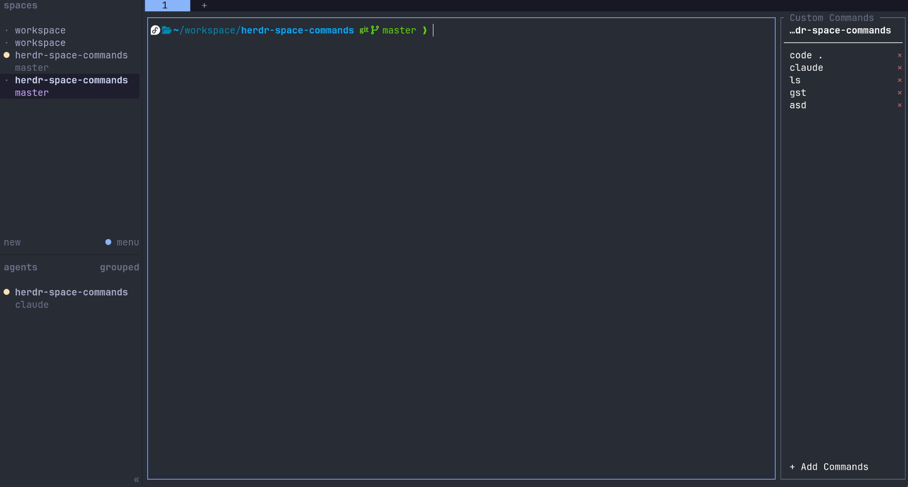

# Herdr Custom Commands

A panel of your own shell commands beside every workspace. Click one and it runs
there, without opening a tab or taking over a pane.



## Install

Needs Herdr 0.7.4 or later, and nothing else: the panel is a static binary for
each platform, with a launcher that picks the right one.

```bash
herdr plugin install zhaoyshine/herdr-custom-commands
```

Restart Herdr. Every workspace opens with a `Custom Commands` panel on its
right, 15% of the tab wide, and new workspaces get one too. Drag the divider to
resize; the panel remembers the width. From a checkout, run
`herdr plugin link /path/to/repo` instead.

## Using the panel

Click a command to run it, `+ Add Command` to add one (type it, then `Enter`),
and `×` to delete one; the wheel moves the selection. The keyboard does the
same: `j`/`k` or the arrows, `g`/`G` for the ends of the list, `Enter` to run,
`a` or space to add, `d` or `x` to delete, `c` to copy the output. No key closes
the panel; close its pane the usual Herdr way. The panel captures the mouse, so
to select text use Herdr's `prefix+[`.

## Your commands

The panel lists the lines of `commands.txt` in the plugin's config directory,
`~/.config/herdr/plugins/config/herdr-custom-commands/`, one command per line.
The panel skips blank lines and lines starting with `#`, so the file can carry
comments of its own.

## Running a command

The panel runs the command in your shell (`$SHELL`), in the directory named at
the top of the panel: the focused pane's directory in that workspace. The panel
sources your shell's rc file first, discarding its output, so aliases such as
`code='flatpak run --command=code com.visualstudio.code'` behave as they do in a
terminal. The process is detached: no terminal, no stop button, and it keeps
running after its pane closes.

## Output

Output appears in the panel above the add row while the command runs, and ends
with `── exited <code> ──`. A command that prints nothing leaves the panel as it
was. The output hides itself 30 seconds after the command exits; put another
number of seconds in `output-timeout` in that config directory, or `0` to keep
it until the next run. Reopen the panel to apply the change.

`copy` in the output header puts the output on the clipboard, and `hide`
dismisses it. The full log is kept in
`~/.local/state/herdr/plugins/herdr-custom-commands/last-run.log`.

## Limits

- No terminal: `vim`, `less`, `top` and other interactive programs do not work
  here.
- One command per line: no arguments prompt, no per-command environment.
- One panel per workspace; a second one closes at once.
- Wide CJK characters in a command line can shift clicks on that row.

## License

MIT
